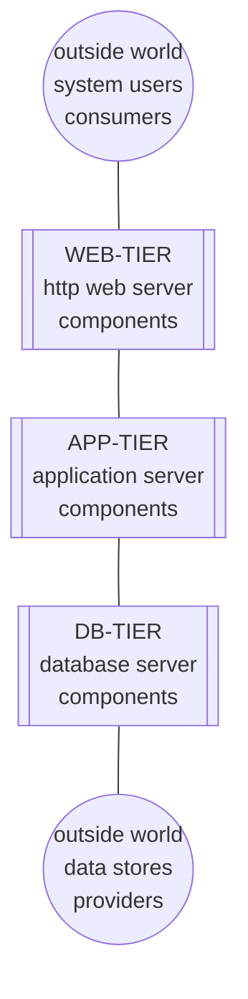
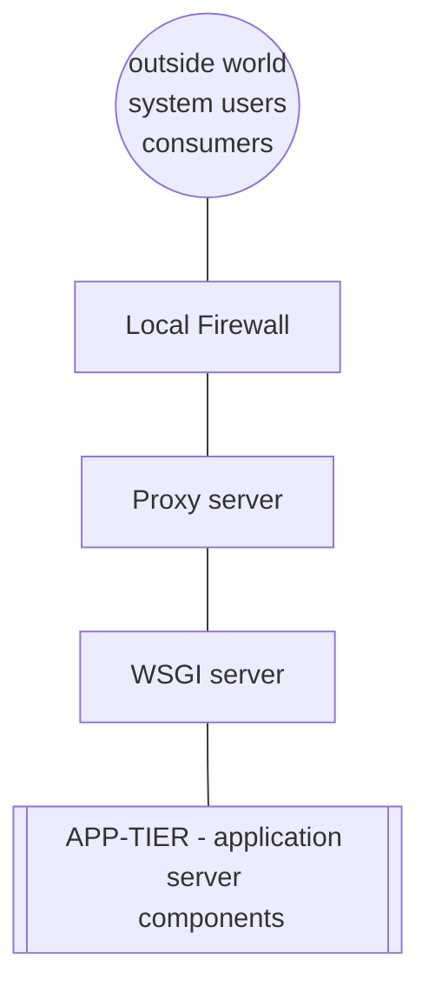
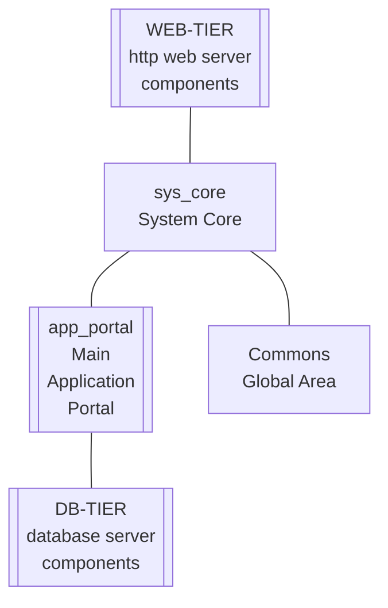
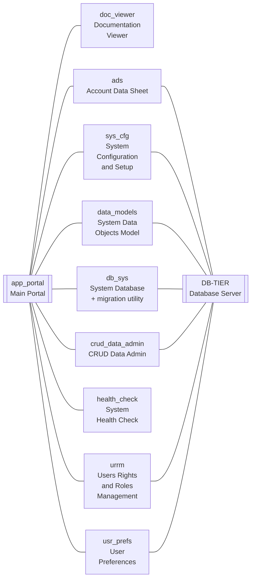
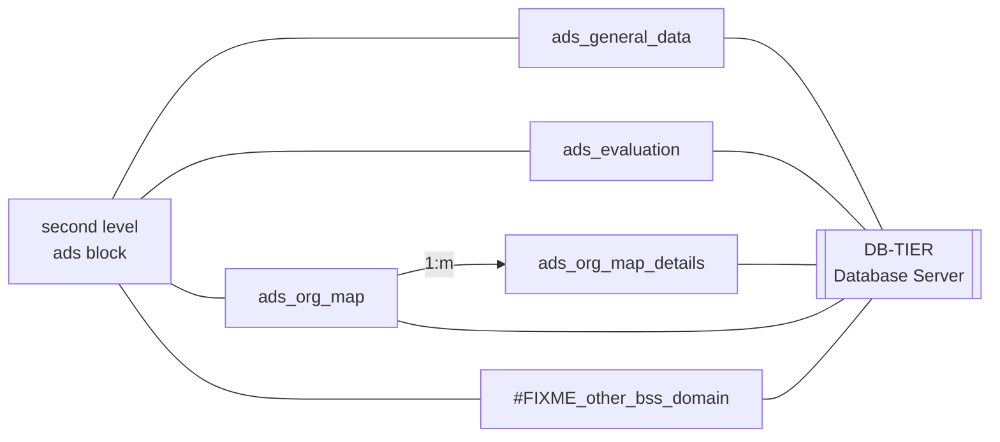

<small>*(c) 2022 RENware Software Systems*</small>

[PDF VERSION](/download{{ request.path }})

<small>

* Version: 0.9.0
* Last update: 230310
</small>

**810.02 System Landscape**

***

[TOC]

***Prerequisites***: 120 System Concepts, 810.00 System Overview

# High Level Architecture

The following diagram shows the whole system (*"forest, not trees"* ) blueprint:

Briefly the each tier is responsible for:

* WEB-TIER application start and listening to client's requests
* APP_TIER application itself
* DB_TIER database access and use

# WEB-TIER description

## Local Firewall

Is responsible for system access allowing on a port. It can simply deny or allow access to a port regardless of application or its state.

In this document will not enter in more details being a classic infrastructure component managed at operating system level.

* ***Implementation:*** `ufw`

## Proxy server

Is responsible for:

* system "re-translation" regarding **port**
* local (machine level) balancing if more than a system is present *on the same server as operating system*
* `SSL` (as `https`) if is required and not already assured outside server

> <small>**WARNING** This component does not make server addresses translations between servers, even is able to do it. 
It is not recommended to "mix" at this level these functionalities, but if required, should be solved with another proxy outside of server.</small>

In this document will not enter in more details being a classic infrastructure component managed at operating system level.

* ***Implementation:*** `nginx community edition`

## WSGI server

Is responsible for web server:

* *listening* to client's requests
* *routing - dispatching* to **APP-TIER** 
* *distributing load* between multiple workers depending on requests volume

> <small>**WARNING** if other implementation product is chosen, this MUST be fully compliant with Python `PEP` standards and with `flask` framework</small> 

* ***Implementation:*** `gunicorn`

# APP-TIER description

## First level diagram

## Second level diagram - app_portal

## ADS level diagram

## Components catalog and their importance

Here is a list of APP tiers components with their importance.

>Importance is presented after component code as: *CRITICAL*, *HIGH*, *MED*, *LOW*. It also give an idea ref priority.

*  sys_core / **CRITICAL**
    *  commons / HIGH
    *  app_portal / **CRITICAL**
        * db_sys / **CRITICAL**
        * data_models / **CRITICAL**
        * crud_data_admin / HIGH
        * ads / HIGH
        * urrm / LOW
        * sys_cfg / MED
        * health_check / LOW
        * usr_prefs / LOW
        * doc_viewer / MED

>Bold importance needs urgent approach. Italic importance is next that should be started.

The following sections present in details each component (these are listed by code-name alphanumeric order).

## Components details

### ads - Account Data Sheet

* *Objective:* core business, sales project / account data sheet and its reviews, this is a set of more objects, the *ads* itself does not exists - please see [*section ADS level diagram*](#ads-level-diagram).
* [*Detailed description*](/ads/README_ads.md)
* *Implementation:* `Flask`
* *Code-name:* `ads`
* *Location:* `ads`

### app_portal - Main Application Portal

* *Objective:* main portal, routes provider, main context provider
* [*Detailed description*](/app_portal/README_app_portal.md)
* *Implementation:* `Flask`
* *Code-name:* `app_portal`
* *Location:* `app_portal`

### commons - Common Global Area

* *Objective:* assure an intra application (between application components) data sharing
* [*Detailed description*](/commons/README_commons.md)
* *Implementation:*  custom dev
* *Code-name:* `commons `
* *Location:* `commons`

### crud_data_admin - CRUD data administration

* *Objective:* component is designed for data administration as classic CRUD functionalities and extendable with specific actions
* [*Detailed description*](/crud_data_admin/README_crud_data_admin.md)
* *Implementation:*  custom dev
* *Code-name:* `crud_data_admin `
* *Location:* `crud_data_admin`

### db_sys - System Database

* *Objective:* assure system databa, database scripts and a migration utility
* [*Detailed description*](/db_sys/README_db_sys.md)
* *Implementation:*
    * DBMS: `SQL Lite` in standard kit (after installation can be replaced with any other DBMS supported by `SQL Alchemy`)
    * migration utility: `Flask Migrate`
* *Code-name:* `db_sys `
* *Locations:* 
    * `db_sys` for component initialization and specific description
    * `data` for physical database (SQL Lite version)
    * `db_scripts` for already generated database scripts
    * `migrations` for migration utility versioned database scripts (including history)

### doc_viewer - Documentation Viewer

* *Objective:* assures markdown and json documentation dynamic viewer and pdf converting and downloading; designed to support help functionality
* [*Detailed description*](/doc_viewer/README_doc_viewer.md)
* *Implementation:* `libutil.md2html`, `libutil.pdf_maker`
* *Code-name:* `doc_viewer`
* *Location:* `doc_viewer`

### (tbd...) sys_cfg - System Configuration and Setup

* *Objective:* system config and setup (wheel icon)
* [*Detailed description*](xxx)
* *Implementation:* custom dev
* *Code-name:* `sys_cfg`
* *Location:* `sys_cfg`

### (tbd...) health_check - System Health Check

* *Objective:* system health check
* [*Detailed description*](/health_check/README_health_check.md)
* *Implementation:* custom dev
* *Code-name:* `health_check`
* *Location:* `health_check`

### sys_core - System Core

* *Objective:* system initializer (initialization routines)
* [*Detailed description*](/sys_core/README_sys_core.md)
* *Implementation:* all initialized components packages
* *Code-name:* `sys_core`
* *Location:* `sys_core`

### data_models - System Data Object and Models

* *Objective:* system data ORM models (general, not tied to a component but more)
* [*Detailed description*](/data_models/README_data_models.md)
* *Implementation:* `SQLAlchemy`
* *Code-name (database):* `db_sys`
* *Code-name (data objects):* `Sys[followed by specific entity object with uppercase]`
* *Code-name:* `data_models`
* *Location:* `data_models`

### (tbd...) urrm - Users Right Roles Management

* *Objective:* management of users, roles and rights
* [*Detailed description*](xxx)
* *Implementation:* custom code, `proposal for `Flask Principal
* *Code-name:* `urrm `
* *Location:* `urrm`

### (tbd...) usr_prefs - User Preferences

* *Objective:* establish user preferences like: language, magnitude for currency values in different scenarios, decimal sign, date formats, etc... also can be imported from browser settings
* [*Detailed description*](xxx)
* *Implementation:* tbd...
* *Code-name:* `usr_prefs `
* *Location:* tbd...

# DB-TIER description

Database tier comprise the system database which is a local database intended to keep all system persisted data. It is physically implemented using `SQLite 3` because its *low footprint* and included in *python 3 standard libraries*

--- ooo ---
