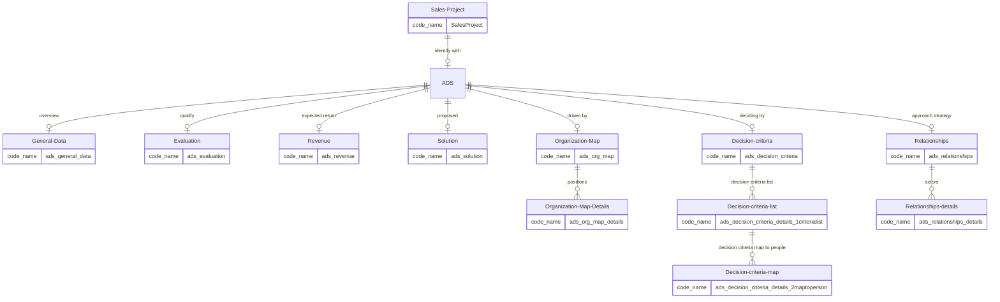
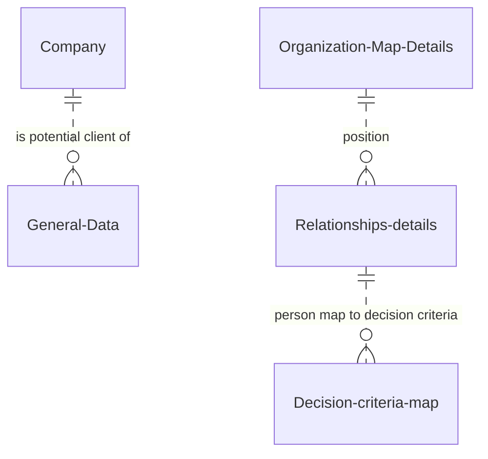

<small>*(c) 2022 RENware Software Systems*</small>

[PDF VERSION](/download{{ request.path }})

<small>

* Version: 0.9.0
* Last update: 230227
</small>

**810.03 System Data & Objects**

***

[TOC]

# Preliminaries

This document describe the **data** and **data objects** used by system.

The system is oriented around sales activity from a business. Therefore the "central" data is imposed by object **sales project**. This is true from functional perspective, not technical.

"Around" this object resides objects like: **client, solution, stakeholders, etc**.

# Conceptual model

## ER Diagrams

### Base principal model

### Extended relationships

## Master business objects

These objects represents master data[^master_data] objects.

* core objects:
    * **Sales project** - keep basic information about a sales project that is intended to be tracked | analyzed | reviewed: a *description* and the *account responsible*
    * **ADS** - represents the Account Data Sheet and it is the "core / centric" of the system[^ADS]
    * <small>NOTE: *Sales project* and *ADS* are not separated objects. In fact they identify one with the other for *COSANA* purposes - an *ADS* has "no reason" without a *Sales project*.</small>

* **Company** - represents a potential or existing client for which is intended to open a new account / sales activity - to be flexible this is subject of ADS  for the following reasons:
    * a sales project can be subject of no client (a project designed for a group of customers)
    * a sales project must be flexible, at least in its inception phase to adapt to potential many challenges and changes
    * really its not the subject of COSANA (it is expected to have an external CRM for that purposes)
* **Solution** - represents a list of owner solutions / products, etc, generally things that are on "selling list" - useful latter for searches, grouping and analysis of *sales accounts*

* **Users** - represents the users used by the system[^urrm]
* **Roles** - represents the roles of system users[^urrm]

# ADS - Account Data Sheet model

The ADS[^ADS] object is the core business object and contains (is broken) the following sections and their mappings to analysis:

<small>***NOTE***: Term *ANA-MAP-page...* refers the analysis "place" where this information comes from; usually this is found in `/100_ANA/ADS_account_data_sheet/` directory.</small>

## General data

Contains general information ref to a *Sales Project*.

* code-name: `ads_general_data`
* analysis reference: [ANA-MAP-page1](/100_ANA/ADS_account_data_sheet/fisa_account_1.jpg)
* **data stored**:
    * **decisive event** that triggered opportunity[^_decisive_event] (*code-name: `_decisive_event`*)
    * short info about potential **competition** (*code-name:* `competition`)
    * short info about potential **potential problems* / implications / risks* (*code-name:* `potential_problems`)
    * short descriptive list of sales **team members** (just to know about them as they could be partially allocated) (*code-name:* `team_members`)
    * shorts info about client (or **client company**) (*code-name:* `client_company`)
* the record has a calculated attribute (`getter`) representing its *TOTAL score*

* **Technical data**:
    * object name: `ads_general_data`
    * relationships: **1** `SalesProject` to **0,1** `ads_general_data`

## Evaluation

Contains information that define the "perception" of strength and probability of sales in this account project.

* code-name: `ads_evaluation`
* analysis reference: [ANA-MAP-page2](/100_ANA/ADS_account_data_sheet/fisa_account_2.jpg)
* each evaluation criteria is an  *ATTRIBUTE* of type `int`, not nullable, *defaulted to 0* which is the minimum score for an evaluation criteria
* each evaluation criteria is a number (`int`) corresponding to a *qualification* detailed in analysis - smallest number represent a lowest evaluation
* the records has a calculated attribute (`getter`) representing its *TOTAL score*
* **data stored**:
    * **remarks** - is a free text (100 characters) to comment about evaluation made or let some museful notes (*code-name:* `remarks`)
    * **opportunity reality** - qualify the opportunity if it is *"real, has some chances to happen"* (equivalent of "AR" from "SMART acronym" used in goals settings)
    * **compete ability** - qualify the capability to compete for this Sales Project (*code-name:* `compete_capability`)
    * **win capability** - qualify the capability to win / close a contract (*code-name:* `win_capability`)
    * **win worth** - qualify the worth to win a contract (*code-name*: `win_worth`)

* **Technical data**:
    * object name: `ads_evaluation`
    * relationships: **1** `SalesProject` to **0,1** `ads_evaluation`

## Organization map

**Organization map** - represents involved persons in account and yhe way they are involved, affected, can be "managed" - [ANA-MAP-page4](/100_ANA/ADS_account_data_sheet/fisa_account_4.jpg). This object enumerates all positions / jobs that are **relevant** for "in subject" **sales project**, from its very first stages up yo concluding a contract. Pay attention here, this object ***DOES NOT ENUMERATE NAMES, BUT JUST POSITIONS / JOBS***. Real occupants, names is subject to *Relationships approach* business domain. The enumeration from this business domain serve *to know what are the "places" that need to be addressed* in development and execution of the sales "in subject" sales-project.

As **implementation**, this business domain consist of 2 (two) objects:

* **MASTER OBJECT: code-name `ads_org_map`** which is the main object related to *SalesProject* object

* **DETAILS OBJECT: code-name `ads_org_map_details`** which contain the *many* list of information required ad is related to `ads_org_map` object. Thus, in this sense, the *DETAILS OBJECT* object must contain the following information / **attributes**:

    * **code** - mandatory String(10), is just a business key helping to easily identify the information
    * **name** - mandatory String(100), largely describe this position as relevant information in sales process
    * **decision_make** - mandatory Boolean designates a job able to make an officially recognized procurement decision
    * **need_to_sign** - mandatory Boolean designates a job required to sign required documents in process
    * **technical_evaluation** - mandatory Boolean designates a job required to make an official technical evaluation of our proposal
    * **financial_evaluation** - mandatory Boolean designates a job required to make an official financial evaluation of our proposal
    * **consultant** - mandatory Boolean designates a job required to make evaluation of our proposal, eventually as 3rd party - this is the "kind of *influencing decision*" by its evaluations, reviews, opinions, etc, *not necessarily made as formal process*

Regarding *MASTER OBJECT*, this acts as a *bridge* from client-side point of view, assuring a maximum transparency ref existence of *DETAILS OBJECT*. Therefore it contains *base standard attributes* (ie, PK and audit ones), the *foreign key* to *Sales Project* (unique) and an attribute usable for **remarks** (`sa.String(100),  nullable=False)`) useful to "explain" what was the intention when add or updated the existing information at *DETAILS OBJECT*.

From the *SalesProject* perspective / point of view, the second object (`ads_org_map_details`) should be completely transparent ("does not know itt exists). All operations should be driven / done through `ads_org_map` object. As technical detail, the `ads_org_map` object will use *JSON* encapsulation to present "the many" part of information (ie, part of the list of data, previously enumerated), using *properties* and *json encoding* to accomplish this requirement.

* **Technical data**:
    * object name: `ads_org_map` (include object `ads_org_map_details`)
    * relationships:
        * **1** `SalesProject` to **0,1** `ads_org_map`
        * **1** `ads_org_map` to **0, 1,m** `ads_org_map_details`

## Relationships approach

**Relationships approach** - represents a set of criteria useful in (human) relationships approach

* analysis reference: [ANA-MAP-page4](/100_ANA/ADS_account_data_sheet/fisa_account_4.jpg)

As **implementation**, this business domain consist of 2 (two) objects:

* **MASTER OBJECT: code-name `ads_relationships`** which is the main object related to *SalesProject* object
* **DETAILS OBJECT: code-name `ads_relationships_details`** which contain the *many* list of information required ad is related to `ads_relationships` object

Regarding *MASTER OBJECT*, this acts as a *bridge* from client-side point of view, assuring a maximum transparency ref existence of *DETAILS OBJECT*. Therefore it contains *base standard attributes* (ie, PK and audit ones), the *foreign key* to *Sales Project* (unique) and an attribute usable for **remarks** (`sa.String(100),  nullable=False)`) useful to "explain" what was the intention when add or updated the existing information at *DETAILS OBJECT*.

The *DETAILS OBJECT* object contains the following information and **data stored**:

* **name** - mandatory *indexed* String representing the name of that person

* **position** - mandatory *indexed* String(20) representing a position from *ADS Organization Map*; this string is the `code` attribute from `ads_org_map_details` object (ie *`ads_org_map_details.code`*); what is useful from this relation is what "qualifiers" are behind `ads_org_map_details.code` (sign-off required, decision maker, etc, see corresponding section for details)
    >*REMARK 1:* left this attribute null is NOT POSSIBLE, NOR RECOMMENDED meaning that person has practically no role in "sales mind schema"
    >*REMARK 2:* relationship with `ads_org_map_details` is not an enforced one not being the object of ADS; latter analysis will make required join, this and related attribute being indexed for better performance

* **change_adaptability** - mandatory *indexed* String(20) representing the adaptability to changes regarding usual (business) practices, instruments, tools, methods, etc - *LOV values (code / text, score, color)*:
    * **Innovator** (score 20) (color GREEN)
    * **Visionary** (score 15) (color YELLOW)
    * **Pragmatic** (score 10) (color ORANGE)
    * **Conservative** (score 5) (color BURGUNDY)
    * **Retrograde** (score 0) (color RED)

* **our_status_in_relation** - mandatory *indexed* String(20) representing our status in relationship with that person - *LOV values (code / text, score, color)*:
    * **Mentor** (score 20) (color GREEN)
    * **Supporter** (score 15) (color YELLOW)
    * **Neutral** (score 10) (color ORANGE)
    * **NON-Supporter** (score 5) (color BURGUNDY)
    * **Enemy** (score 0) (color RED)

* **contact_status** - mandatory *indexed* String(20) representing the status of contact with that person - *LOV values (code, text, score, color)*:
    * **Detailed-Knowledge** (score 15) (color GREEN)
    * **Multiple-Contacts** (score 10) (color YELLOW)
    * **Briefly-Contacted** (score 5) (color ORANGE)
    * **NOT-Contacted** (score 0) (color RED)

* GENERAL NOTES:
    * code and text in LOV has the same value and that's the reason of using dash ('-') for text of more that 1 word
    * Term *(ADS) Relationships* is frequently used as a shortcut to *(ADS) Relationships Approach* SIGNIFYING THE SAME THING (being it object, entity, functionality and so on)

* **Technical data**:
    * object name: `ads_relationships`
    * relationships:
        * **1** `SalesProject` to **0,1** `ads_relationships`
        * **1** `ads_relationships` to **0, 1,m** `ads_relationships_details`

## Revenue

**Revenue** - contains information about expected revenue generated by this account project; these information are alo subject to a potential integration with an external CRM system and an external ERP system for contracts evaluations purposes for example.

* code-name: `ads_revenue`

* analysis reference: [ANA-MAP-page1](/100_ANA/ADS_account_data_sheet/fisa_account_1.jpg)

* attributes:
    * **remarks** - is a free text (100 characters) to comment about revenue estimation made or let some museful notes (*code-name:* `remarks`)
    * **max_expected** - is a float number representing *MAXIMUM revenue expected* from a potential contract resulted from "in-subject" sales project - mandatory, default 0 (zero)
    * **min_expected** - is a float number representing *MINIMUM revenue expected* from a potential contract resulted from "in-subject" sales project - mandatory, default 0 (zero)
    * **allocated_budget** - is a float number representing *the BUDGET ALLOCATED by client* for this project - mandatory, default 0 (zero)
    * **customer_min_expectation** - is a float number representing *MINIMUM value expected by customer* for this project - mandatory, default 0 (zero)
    * **customer_max_expectation** - is a float number representing *MAXIMUM value expected by customer* for this project - mandatory, default 0 (zero)
    * **market_price** - is a float number representing *market usual price* for this kind of projects - mandatory, default 0 (zero)

* NOTES:
    * any numerical value equals to 0 (zero) means or "that's the truth" or that information is not known (in this case the best value usable is 0 regarding to revenues and budgets)
    * score will be granted based on ***number of known items*** and NOT based on their values

* **Technical data**:
    * object name: `ads_revenue`
    * relationships: **1** `SalesProject` to **0,1** `ads_revenue`

## Solution

**Solution** - contains a description of potential solutions that can be proposed for sales. Note that description must be simple and short, just enough to find more details in other place - [ANA-MAP-page3](/100_ANA/ADS_account_data_sheet/fisa_account_3.jpg). Each "solution object" is composed of *MASTER OBJECT* and *DETAILS OBJECT*.

**MASTER *OBJECT* (`ads_solution`) contains the following**attributes**:

* **name** - required String(100) with a "internally (in your company)recognizable" name of solution - indexed to allow fas searches

* **description** - a free mandatory text (any length) with a comprehensive description of solution - this is a *required* attribute - Markdown is allowed here

* **remarks** - is a free text (100 characters) to make relevant / useful comments about solution (usable for revision meetings for example)

**DETAILS OBJECT** (`ads_solution_details`) contains a list of *"solution elements"* (ie, that characterize the solution). These *elements* can be: ***strong*** / ***weak*** and ***characteristics*** /  ***advantages*** / ***benefits***. In this way, this object contains the following **attributes**:

* **name** - String(50), *required*, *indexed* - is a name of describing solution element - *unique* for solution (uniqueness is implemented for `ads_solution` foreign key, meaning that element will be unique just for respective sales Project and not interfere with other sales projects)

* **strength** - mandatory *indexed* String(20) representing the strength of that element - *LOV values (code, text, score, color)*:
    * **Strong** (score 10) (color GREEN)
    * **Weak** (score 0) (color RED)

* **feature_type** - mandatory *indexed* String(20) representing the type of that element - *LOV values (code, text, score)*:
    * **Benefit** (score 20) (color GREEN)
    * **Advantage** (score 10) (color ORANGE)
    * **Characteristic** (score 0) (color RED)

>**BUSINESS NOTES:**
>
> * `element_strength` - can vary in time depending of client perception to solution compared to what already exists on market or current practices
> * `element_type` - can vary in time depending of client real needs regarding that element:
>     * A *characteristic* is something that define solution but is not required and not needed
>     * An *advantage* is something that define solution but is not explicitly required by client but is required for other reasons, usually technical ones like security for example
>     * An *benefit* is something that define solution and is explicitly required by client

* **Technical data**:
    * object name: `ads_solution`
    * relationships:
        * **1** `SalesProject` to **0,1** `ads_solution`
        * **1** `ads_solution` to **0, 1,m** `ads_solution_details`

## Decision criteria

**Decision criteria** - represents *decision making criteria* set as seen and perceived by reviewer - [ANA-MAP-page3](/100_ANA/ADS_account_data_sheet/fisa_account_3.jpg). Each "decision criteria object" is composed of three objects:

* `ads_decision_criteria` - this is the **MASTER OBJECT** linked to a *Sales Project*
* `ads_decision_criteria_details_1criterialist` - this is the 1st level of details, **DECISION CRITERIA OBJECT** which contains the *list of all decision criteria*
* `ads_decision_criteria_details_2maptoperson` - this is the 2nd level of details, **PEOPLE MAP TO CRITERIA OBJECT** which contains the *"positioning" / "perception" of each person versus decision each criteria*

Next, the levels will be described individually.

### MASTER object

* code-name: `ads_decision_criteria`
* attributes:
    * **remarks** - is a free text (100 characters) to comment about evaluation made or let some museful notes (*code-name:* `remarks`)
* relationships: `me` 0,1:1 `SalesProject`

### DECISION CRITERIA object

* code-name: `ads_decision_criteria_details_1criterialist`
* attributes:
    * **name** - String(50), *required*, *indexed* - is a name of *decision criteria* element - *unique* for decision criteria set (ie, MASTER OBJECT level)
    * **our_status** - mandatory *indexed* String(20) representing the *our solution status versus* the decision criteria element - *LOV values (code, text, score, color)*:
        * **Strong** (score 10) (color GREEN)
        * **Weak** (score 0) (color RED)
* relationships: `me` 0,m:1 `ads_decision_criteria` (MASTER object)

### PEOPLE MAP TO CRITERIA object

* code-name: `ads_decision_criteria_details_2maptoperson`
* attributes:
    * **client_importance** - mandatory *indexed* String(20) representing the *potential customer importance given to the decision criteria element* - *LOV values (code, text, score, color)*:
        * **Top** (score 100) (color RED)
        * **Medium** (score 50) (color ORANGE)
        * **Low** (score 25) (color GREEN)
        * **Neutral** (score 0) (color GRAY)
* relationships:
    * `me` 1,m:1 `ads_decision_criteria_details_1criterialist` (DECISION CRITERIA object)
    * `me` 0,m:1 `ads_relationships_details` (Relationships details object)

### LOV object

LOV object describes the values of fields: `our_status` from DECISION CRITERIA OBJECT and `client_importance` from PEOPLE MAP TO CRITERIA OBJECT

* code-name: `lov_ads_decision_criteria`

# Helper objects

 of system are intended the following objects:

* **Importance Factors** - is not a direct business object but with *relevant impact*. This object establish a formal vocabulary & scale for various importance factors like: *good* (with scale rank 1), *critical* (with scale rank 8), and so on. This vocabulary is specific to business where COSANA product is used.

>Helper objects are intended to be implemented in future versions. They can exists but might not be used or partially used in current version.

[^ADS]: **ADS** = Account Data Sheet (_RO: Fisa contului_)
[^urrm]: **URRM** - the users and roles might not be implemented or may be disabled in version 1 of system
[^_decisive_event]: **Decisive event** - RO: evenimentul determinant
[^master_data]: **Master data** - represents data with low changes rate, with interest at cross organization level and subject of interfacing with other systems
